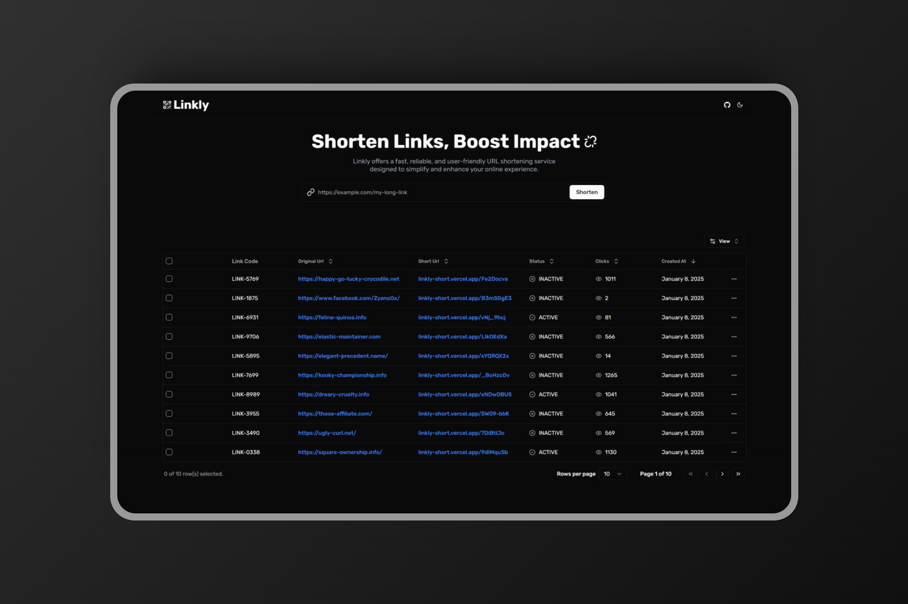

# [Linkly](https://linkly-short.vercel.app)

## Tech Stack

- **Framework:** [Next.js](https://nextjs.org)
- **Styling:** [Tailwind CSS](https://tailwindcss.com)
- **UI Components:** [shadcn/ui](https://ui.shadcn.com)
- **Table:** [Shadcn Table](https://github.com/sadmann7/shadcn-table)
- **Database:** [Supabase](https://supabase.com/)
- **ORM:** [Prisma ORM](https://www.prisma.io/orm)
- **Validation:** [Zod](https://zod.dev)

## Features

- [x] Quickly generate short, easy-to-share URLs from long URLs
- [x] View and manage a list of all generated short links
- [x] Track the number of times each link is clicked
- [x] Automatically generate a QR code for each shortened URL